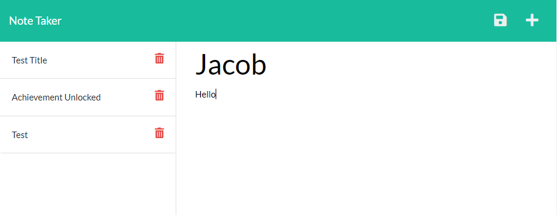

# The Notebook

## Description
Have you ever been forced to watch a romance movie by your significant other only to have it be the best and saddest romance movie you've ever seen? So much so that you need to take notes about it? Ditch the paper and pen and switch to The Notebook. This full-stack application uses HTML, CSS, JavaScript, Node.js, Bootstrap, Express.js and uuid which allows the user to take notes and save them online.

## Deployed Application

[The Notebook](https://aqueous-shore-60005.herokuapp.com/)

## Install
After cloning the repo the user can run `npm install` in the terminal to install the required dependencies.

## License
MIT License